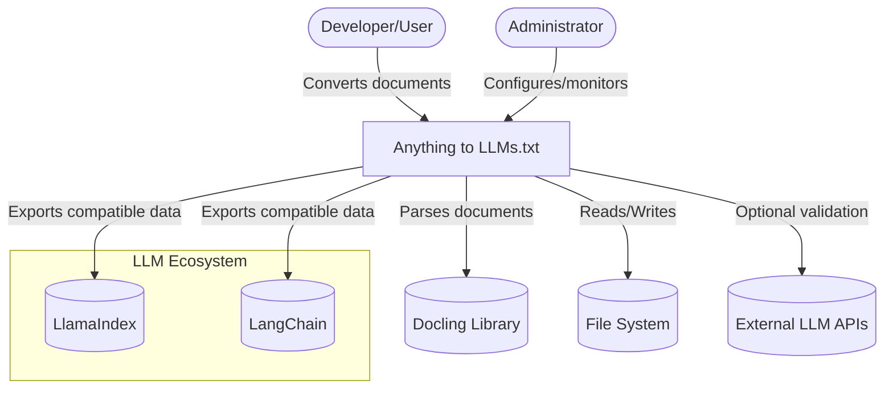
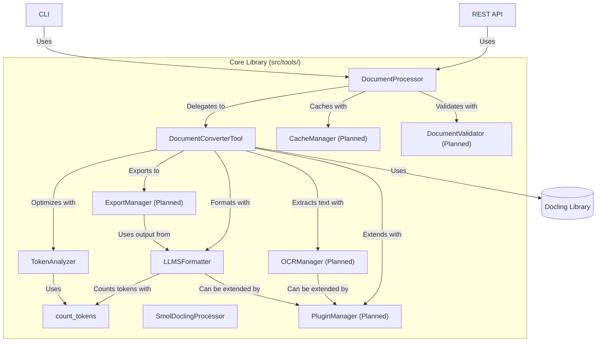
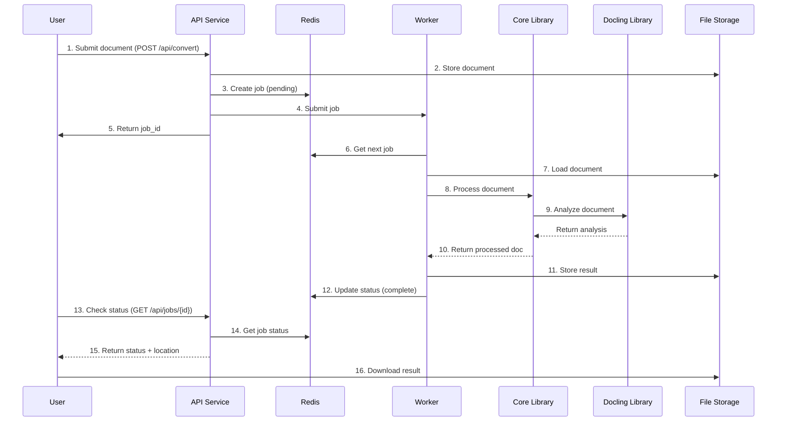

[](https://github.com/cristianocosta/anything-to-llms-txt)
[](LICENSE)
[](https://www.python.org/)
[](https://github.com/cristianocosta/anything-to-llms-txt/actions)
[](https://github.com/cristianocosta/anything-to-llms-txt/issues)
[](https://github.com/cristianocosta/anything-to-llms-txt/pulls)
[](https://github.com/cristianocosta/anything-to-llms-txt/stargazers)

# Anything to LLMs.txt

> **Universal document converter to the structured LLMs.txt format, optimized for use with Large Language Models (LLMs).**

---

## ✨ Overview

Anything to LLMs.txt transforms documents in PDF, DOCX, HTML, TXT, and other formats into structured `.llms.txt` files, ready for LLM ingestion. It preserves tables, images, metadata, and offers customizable output profiles, smart chunking, and token analysis.

---

## 📦 Installation

```bash
git clone https://github.com/cristianocosta/anything-to-llms-txt.git
cd anything-to-llms-txt
pip install -r requirements.txt
```

---

## 🚀 Quick Start

```bash
python -m src.main --file data/test_files/exemplo.pdf
```

### Custom Chunking

```bash
python -m src.main --file data/test_files/exemplo.pdf --chunk-size 1000 --chunk-overlap 100
```

### Output Profiles

```bash
python -m src.main --file data/test_files/exemplo.pdf --profile llms-tables
```

### Token Analysis

```bash
python -m src.main --count-tokens output/exemplo.llms.txt --analyze
```

### Batch Processing

```bash
python examples/document_analysis_example.py -dir data/test_files -p "*.pdf" -v -b "termos importantes" -c
```

---

## 🧩 Output Profiles

- `llms-min`: Main text only
- `llms-ctx`: Text + minimal context
- `llms-tables`: Includes tables
- `llms-images`: Includes images
- `llms-raw`: Includes raw text
- `llms-full`: All sections

---

## 🛠️ CLI Options & Parameters

```text
usage: python -m src.main [options]

optional arguments:
  -h, --help            Show this help message
  --file FILE, -f FILE  Path to the file to process
  --no-save, -n         Do not save the result to a file
  --view, -v            Display the full content in the terminal
  --chunk-size CHUNK_SIZE
  --chunk-overlap CHUNK_OVERLAP
  --plugins PLUGINS     Docling plugins (tables,images,raw)
  --pipeline-options PIPELINE_OPTIONS
  --profile {llms-min,llms-ctx,llms-tables,llms-images,llms-raw,llms-full}
  --model-name MODEL_NAME
  --count-tokens FILE
  --analyze, -a
  --verbose, -vb
```

### Opções do Document Analysis Example

```text
usage: document_analysis_example.py [options]

optional arguments:
  -h, --help                     Mostrar esta mensagem de ajuda
  -d, --documento DOCUMENTO     Caminho para o documento a ser analisado
  -dir, --diretorio DIRETORIO   Diretório para processamento em lote de documentos
  -p, --padrao PADRAO           Padrão de arquivos para processamento em lote (padrão: *.pdf)
  -v, --visualizar              Gerar visualização HTML do documento
  -b, --buscar TEXTO            Texto a ser buscado no documento
  -c, --classificar             Classificar imagens no documento
  -s, --saida DIRETORIO         Diretório para salvar resultados (padrão: ./resultados)
  -l, --limite VALOR            Limite de confiança para classificação de imagens (0-1)
```

---

## 🗂️ LLMs.txt File Structure

```text
# Title: Document Name
# Date: 2025-04-26 10:30:00
# Source: path/to/file.pdf

# Summary
Document summary...

# Content
Main text...

# Tables
## Table 1
| Column 1 | Column 2 |
|----------|----------|
| Value 1  | Value 2  |

# Images
## Image 1
Image description...

# Raw
Raw text...
```

---

## 🧰 Document Analysis Features

Além da conversão para LLMs.txt, o sistema oferece recursos avançados de análise de documentos:

- **Processamento em Lote:** Processe múltiplos documentos em um diretório com um único comando
- **Busca de Texto com Posicionamento:** Localize termos específicos e obtenha suas coordenadas no documento
- **Classificação de Imagens:** Identifique o conteúdo de imagens nos documentos
- **Visualização HTML:** Gere representações visuais interativas dos documentos processados
- **Relatórios Detalhados:** Obtenha relatórios completos do processamento em lote com métricas e resultados

### Exemplo de Processamento em Lote

```python
from src.tools.document_converter import DocumentConverter

converter = DocumentConverter()
resultados = converter.processar_em_lote(
    diretorio="./documentos",
    padrao="*.pdf",
    opcoes={
        "visualizar": True,
        "buscar": "inteligência artificial",
        "classificar": True,
        "limite_confianca": 0.6,
        "diretorio_saida": "./resultados"
    }
)

# Acessar resultados individuais
for arquivo, resultado in resultados.items():
    print(f"Arquivo: {arquivo}, Status: {resultado['status']}")
    if resultado.get("busca"):
        print(f"  Ocorrências encontradas: {resultado['busca']['resultados']}")
```

---

## 🤖 Automatic Content Type Detection

The system automatically identifies:

- Scientific articles
- Literature
- Technical documents
- Educational content
- Legal documents
- Emails/communication

It suggests ideal chunking and LLM model for each case.

---

## 🏗️ System Architecture (C4 Model)

The architecture of Anything to LLMs.txt is designed using the [C4 model](https://c4model.com/), providing a clear, multi-level view of the system:

### Level 1: System Context



*Users interact with the system to convert documents. The system relies on Docling for parsing, interacts with the file system, and can integrate with LLM APIs and export to LlamaIndex/LangChain.*

### Level 2: Container Diagram

```mermaid
flowchart TD
    User([Developer/User])
    Admin([Administrator])
    subgraph "Anything to LLMs.txt System"
        CLI[CLI src/main.py]
        API[REST API src/api/]
        WebUI[Web UI (Planned)]
        CoreLib[Core Library src/tools/]
        Redis[(Redis)]
        Worker[Async Worker]
        Config[Config Manager (Planned)]
    end
    Docling[(Docling Library)]
    FileSystem[(File System)]
    Logging[(Logging Service)]
    User -->|"Uses"| CLI
    User -->|"Uses"| API
    User -->|"Browser access"| WebUI
    Admin -->|"Manages"| Config
    Admin -->|"Monitors"| Logging
    CLI -->|"Uses"| CoreLib
    CLI -->|"Reads config"| Config
    API -->|"Uses"| CoreLib
    API -->|"Reads/Writes status"| Redis
    API -->|"Delegates tasks"| Worker
    API -->|"Reads config"| Config
    WebUI -->|"Calls"| API
    Worker -->|"Uses"| CoreLib
    Worker -->|"Uses queue"| Redis
    CoreLib -->|"Uses"| Docling
    CoreLib -->|"Reads/Writes"| FileSystem
    CoreLib -->|"Reports status/errors"| Logging
    CoreLib -->|"Reads config"| Config
```

*The system is modular: CLI, API, and workers all use the core library. Redis is used for job management. Web UI and config manager are planned.*

### Level 3: Component Diagram (Core Library)



*The core library is highly modular, with clear separation of concerns and extensibility points for future features.*

### Level 4: Processing Flow



*The system uses asynchronous job processing for scalability and responsiveness, ideal for large documents.*

---

## ⚙️ Tech Stack & Design Decisions

- **FastAPI** for async REST API (OpenAPI docs, Pydantic validation)
- **Redis** for job queueing and status
- **Docker** for containerization and deployment
- **Docling** for robust document parsing
- **Modular Python** for extensibility and testability
- **Workers** for background processing

*See [docs/architecture.md](docs/architecture.md) for detailed rationale and alternatives considered.*

---

## 🚦 Roadmap & Next Steps

- Implement planned components: PluginManager, ExportManager, CacheManager, DocumentValidator, OCRManager
- Develop Web UI for uploads and job tracking
- Centralized config manager
- More automated tests and advanced usage examples
- Integrate with more LLM frameworks
- Optimize for large-scale, multi-format batch processing

*See the [architecture doc](docs/architecture.md#roadmap-e-próximos-passos) for more.*

---

## 📚 Further Reading & Full Documentation

> Internal documentation (architecture, API reference, guides, changelogs, advanced setup) is now in the `docs/` folder, which is not tracked by git. Please refer to the latest internal documentation in your local workspace.

---

> Made with ❤️ to accelerate LLM and complex data workflows!

---

**TL;DR:**
Anything to LLMs.txt is a universal converter that transforms documents into a structured format optimized for LLMs, supporting advanced chunking, output profiles, token analysis, and batch processing. Easy to install, flexible to use, and ready for integration into your AI workflows.
