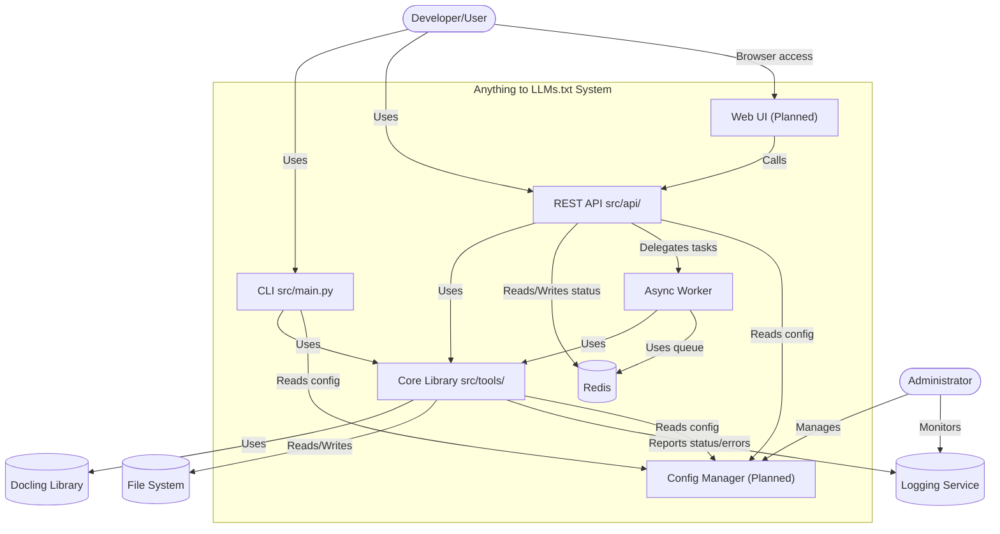

<div align="center">

# 📄 ➡️ 🧠 Anything to LLMs.txt

<!-- Project Status -->
[](https://github.com/cristianocosta/anything-to-llms-txt)
[](LICENSE)
[](https://github.com/cristianocosta/anything-to-llms-txt/actions)

<!-- Technology -->
[](https://www.python.org/)
[](https://fastapi.tiangolo.com/)
[](https://www.docker.com/)

<!-- Features -->
[](https://github.com/cristianocosta/anything-to-llms-txt)
[](https://github.com/cristianocosta/anything-to-llms-txt)
[](https://github.com/cristianocosta/anything-to-llms-txt)

<!-- Community -->
[](https://github.com/cristianocosta/anything-to-llms-txt/issues)
[](https://github.com/cristianocosta/anything-to-llms-txt/pulls)
[](https://github.com/cristianocosta/anything-to-llms-txt/stargazers)

</div>

> **Universal document converter to the structured LLMs.txt format, optimized for use with Large Language Models (LLMs).**
>
> ⚠️ **This project is a Work In Progress (WIP).** Features may change, and some functionality might be incomplete.

---

## ✨ Overview

Anything to LLMs.txt transforms documents in PDF, DOCX, HTML, TXT, and other formats into structured `.llms.txt` files, ready for LLM ingestion. It preserves tables, images, metadata, and offers customizable output profiles, smart chunking, and token analysis.

---

## 📦 Installation

> ⚠️ **Note:** As this is a WIP project, installation and dependencies may change.

```bash
git clone https://github.com/cristianocosta/anything-to-llms-txt.git
cd anything-to-llms-txt
pip install -r requirements.txt
```

---

## 🚀 Quick Start

```bash
python -m src.main --file data/test_files/example.pdf
```

### Custom Chunking

```bash
python -m src.main --file data/test_files/example.pdf --chunk-size 1000 --chunk-overlap 100
```

### Output Profiles

```bash
python -m src.main --file data/test_files/example.pdf --profile llms-tables
```

### Token Analysis

```bash
python -m src.main --count-tokens output/example.llms.txt --analyze
```

### Batch Processing

```bash
python examples/document_analysis_example.py -dir data/test_files -p "*.pdf" -v -b "important terms" -c
```

---

## 🧩 Output Profiles

- `llms-min`: Main text only
- `llms-ctx`: Text + minimal context
- `llms-tables`: Includes tables
- `llms-images`: Includes images
- `llms-raw`: Includes raw text
- `llms-full`: All sections

---

## 🛠️ CLI Options & Parameters

```text
usage: python -m src.main [options]

optional arguments:
  -h, --help            Show this help message
  --file FILE, -f FILE  Path to the file to process
  --no-save, -n         Do not save the result to a file
  --view, -v            Display the full content in the terminal
  --chunk-size CHUNK_SIZE
  --chunk-overlap CHUNK_OVERLAP
  --plugins PLUGINS     Docling plugins (tables,images,raw)
  --pipeline-options PIPELINE_OPTIONS
  --profile {llms-min,llms-ctx,llms-tables,llms-images,llms-raw,llms-full}
  --model-name MODEL_NAME
  --count-tokens FILE
  --analyze, -a
  --verbose, -vb
```

### Document Analysis Example Options

```text
usage: document_analysis_example.py [options]

optional arguments:
  -h, --help                     Show this help message
  -d, --document DOCUMENT       Path to the document to be analyzed
  -dir, --directory DIRECTORY   Directory for batch processing of documents
  -p, --pattern PATTERN         File pattern for batch processing (default: *.pdf)
  -v, --visualize               Generate HTML visualization of the document
  -b, --search TEXT             Text to search in the document
  -c, --classify                Classify images in the document
  -s, --output DIRECTORY        Directory to save results (default: ./results)
  -l, --limit VALUE             Confidence threshold for image classification (0-1)
```

---

## 🗂️ LLMs.txt File Structure

```text
# Title: Document Name
# Date: 2025-04-26 10:30:00
# Source: path/to/file.pdf

# Summary
Document summary...

# Content
Main text...

# Tables
## Table 1
| Column 1 | Column 2 |
|----------|----------|
| Value 1  | Value 2  |

# Images
## Image 1
Image description...

# Raw
Raw text...
```

---

## 🧰 Document Analysis Features

In addition to converting to LLMs.txt, the system offers advanced document analysis features:

- **Batch Processing:** Process multiple documents in a directory with a single command
- **Text Search with Positioning:** Locate specific terms and get their coordinates in the document
- **Image Classification:** Identify the content of images in documents
- **HTML Visualization:** Generate interactive visual representations of processed documents
- **Detailed Reports:** Get complete batch processing reports with metrics and results

### Batch Processing Example

```python
from src.tools.document_converter import DocumentConverter

converter = DocumentConverter()
results = converter.process_batch(
    directory="./documents",
    pattern="*.pdf",
    options={
        "visualize": True,
        "search": "artificial intelligence",
        "classify": True,
        "confidence_threshold": 0.6,
        "output_directory": "./results"
    }
)

# Access individual results
for file, result in results.items():
    print(f"File: {file}, Status: {result['status']}")
    if result.get("search"):
        print(f"  Occurrences found: {result['search']['results']}")
```

---

## 🤖 Automatic Content Type Detection

The system automatically identifies:

- Scientific articles
- Literature
- Technical documents
- Educational content
- Legal documents
- Emails/communication

It suggests ideal chunking and LLM model for each case.

---

## 🏗️ System Architecture (C4 Model)

The architecture of Anything to LLMs.txt is designed using the [C4 model](https://c4model.com/), providing a clear, multi-level view of the system:

### Level 1: System Context


*Users interact with the system to convert documents. The system relies on Docling for parsing, interacts with the file system, and can integrate with LLM APIs and export to LlamaIndex/LangChain.*

### Level 2: Container Diagram



*The system is modular: CLI, API, and workers all use the core library. Redis is used for job management. Web UI and config manager are planned.*

### Level 3: Component Diagram (Core Library)


*The core library is highly modular, with clear separation of concerns and extensibility points for future features.*

### Level 4: Processing Flow


*The system uses asynchronous job processing for scalability and responsiveness, ideal for large documents.*

---

## ⚙️ Tech Stack & Design Decisions

- **FastAPI** for async REST API (OpenAPI docs, Pydantic validation)
- **Redis** for job queueing and status
- **Docker** for containerization and deployment
- **Docling** for robust document parsing
- **Modular Python** for extensibility and testability
- **Workers** for background processing

*The architecture is designed for modularity, scalability, and extensibility.*

---

## 🚦 Roadmap & Next Steps

As this is a **Work In Progress (WIP)**, we're actively developing the following features:

- Implement planned components: PluginManager, ExportManager, CacheManager, DocumentValidator, OCRManager
- Develop Web UI for uploads and job tracking
- Centralized config manager
- More automated tests and advanced usage examples
- Integrate with more LLM frameworks
- Optimize for large-scale, multi-format batch processing

*These improvements will enhance the system's capabilities and user experience. Contributions and feedback are welcome!*

---

## 📚 Further Reading & Full Documentation

> Internal documentation (architecture, API reference, guides, changelogs, advanced setup) is now in the `docs/` folder, which is not tracked by git. Please refer to the latest internal documentation in your local workspace.

---

> Made with ❤️ to accelerate LLM and complex data workflows!

---

**TL;DR:**
Anything to LLMs.txt is a universal converter that transforms documents into a structured format optimized for LLMs, supporting advanced chunking, output profiles, token analysis, and batch processing. Easy to install, flexible to use, and ready for integration into your AI workflows.
