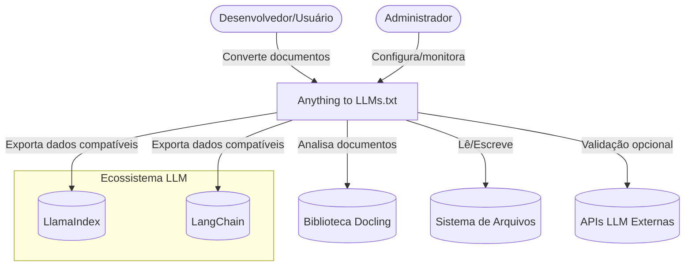
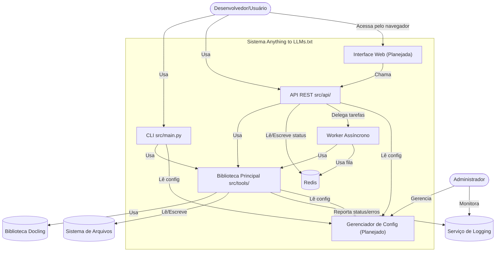
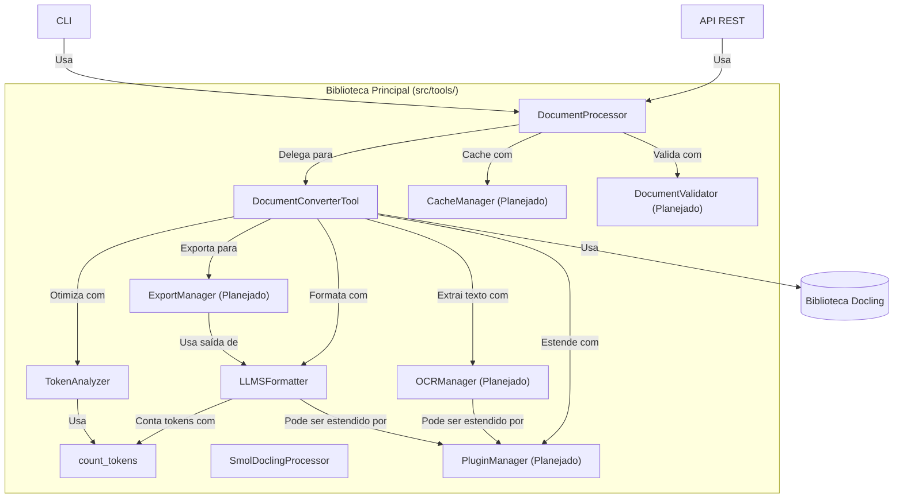
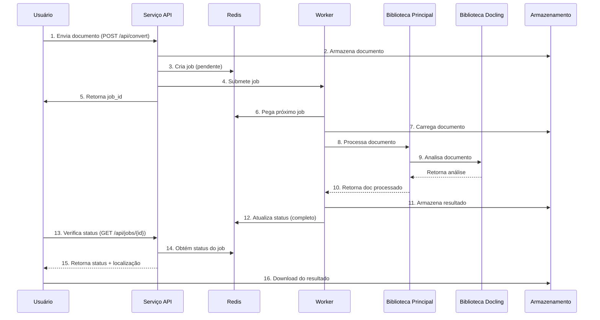

<div align="center">

# 📄 ➡️ 🧠 Anything to LLMs.txt

<!-- Status do Projeto -->
[](https://github.com/cristianocosta/anything-to-llms-txt)
[](LICENSE)
[](https://github.com/cristianocosta/anything-to-llms-txt/actions)

<!-- Tecnologia -->
[](https://www.python.org/)
[](https://fastapi.tiangolo.com/)
[](https://www.docker.com/)

<!-- Recursos -->
[](https://github.com/cristianocosta/anything-to-llms-txt)
[](https://github.com/cristianocosta/anything-to-llms-txt)
[](https://github.com/cristianocosta/anything-to-llms-txt)

<!-- Comunidade -->
[](https://github.com/cristianocosta/anything-to-llms-txt/issues)
[](https://github.com/cristianocosta/anything-to-llms-txt/pulls)
[](https://github.com/cristianocosta/anything-to-llms-txt/stargazers)

</div>

> **Conversor universal de documentos para o formato estruturado LLMs.txt, otimizado para uso com Grandes Modelos de Linguagem (LLMs).**
>
> ⚠️ **Este projeto é um Trabalho em Andamento (WIP).** Os recursos podem mudar e algumas funcionalidades podem estar incompletas.

---

## ✨ Visão Geral

Anything to LLMs.txt transforma documentos em PDF, DOCX, HTML, TXT e outros formatos em arquivos `.llms.txt` estruturados, prontos para ingestão por LLMs. Preserva tabelas, imagens, metadados e oferece perfis de saída personalizáveis, chunking inteligente e análise de tokens.

---

## 📦 Instalação

> ⚠️ **Nota:** Como este é um projeto em desenvolvimento, a instalação e as dependências podem mudar.

```bash
git clone https://github.com/cristianocosta/anything-to-llms-txt.git
cd anything-to-llms-txt
pip install -r requirements.txt
```

---

## 🚀 Início Rápido

```bash
python -m src.main --file data/test_files/example.pdf
```

### Chunking Personalizado

```bash
python -m src.main --file data/test_files/example.pdf --chunk-size 1000 --chunk-overlap 100
```

### Perfis de Saída

```bash
python -m src.main --file data/test_files/example.pdf --profile llms-tables
```

### Análise de Tokens

```bash
python -m src.main --count-tokens output/example.llms.txt --analyze
```

### Processamento em Lote

```bash
python examples/document_analysis_example.py -dir data/test_files -p "*.pdf" -v -b "termos importantes" -c
```

---

## 🧩 Perfis de Saída

- `llms-min`: Apenas texto principal
- `llms-ctx`: Texto + contexto mínimo
- `llms-tables`: Inclui tabelas
- `llms-images`: Inclui imagens
- `llms-raw`: Inclui texto bruto
- `llms-full`: Todas as seções

---

## 🛠️ Opções e Parâmetros da CLI

```text
uso: python -m src.main [opções]

argumentos opcionais:
  -h, --help            Mostra esta mensagem de ajuda
  --file FILE, -f FILE  Caminho para o arquivo a ser processado
  --no-save, -n         Não salva o resultado em um arquivo
  --view, -v            Exibe o conteúdo completo no terminal
  --chunk-size CHUNK_SIZE
  --chunk-overlap CHUNK_OVERLAP
  --plugins PLUGINS     Plugins Docling (tables,images,raw)
  --pipeline-options PIPELINE_OPTIONS
  --profile {llms-min,llms-ctx,llms-tables,llms-images,llms-raw,llms-full}
  --model-name MODEL_NAME
  --count-tokens FILE
  --analyze, -a
  --verbose, -vb
```

### Opções do Exemplo de Análise de Documentos

```text
uso: document_analysis_example.py [opções]

argumentos opcionais:
  -h, --help                     Mostra esta mensagem de ajuda
  -d, --document DOCUMENT       Caminho para o documento a ser analisado
  -dir, --directory DIRECTORY   Diretório para processamento em lote de documentos
  -p, --pattern PATTERN         Padrão de arquivo para processamento em lote (padrão: *.pdf)
  -v, --visualize               Gera visualização HTML do documento
  -b, --search TEXT             Texto para buscar no documento
  -c, --classify                Classifica imagens no documento
  -s, --output DIRECTORY        Diretório para salvar resultados (padrão: ./results)
  -l, --limit VALUE             Limite de confiança para classificação de imagens (0-1)
```

---

## 🗂️ Estrutura de Arquivo LLMs.txt

```text
# Título: Nome do Documento
# Data: 2025-04-26 10:30:00
# Fonte: caminho/para/arquivo.pdf

# Resumo
Resumo do documento...

# Conteúdo
Texto principal...

# Tabelas
## Tabela 1
| Coluna 1 | Coluna 2 |
|----------|----------|
| Valor 1  | Valor 2  |

# Imagens
## Imagem 1
Descrição da imagem...

# Bruto
Texto bruto...
```

---

## 🧰 Recursos de Análise de Documentos

Além de converter para LLMs.txt, o sistema oferece recursos avançados de análise de documentos:

- **Processamento em Lote:** Processa múltiplos documentos em um diretório com um único comando
- **Busca de Texto com Posicionamento:** Localiza termos específicos e obtém suas coordenadas no documento
- **Classificação de Imagens:** Identifica o conteúdo das imagens nos documentos
- **Visualização HTML:** Gera representações visuais interativas dos documentos processados
- **Relatórios Detalhados:** Obtém relatórios completos de processamento em lote com métricas e resultados

### Exemplo de Processamento em Lote

```python
from src.tools.document_converter import DocumentConverter

converter = DocumentConverter()
results = converter.process_batch(
    directory="./documents",
    pattern="*.pdf",
    options={
        "visualize": True,
        "search": "inteligência artificial",
        "classify": True,
        "confidence_threshold": 0.6,
        "output_directory": "./results"
    }
)

# Acessa resultados individuais
for file, result in results.items():
    print(f"Arquivo: {file}, Status: {result['status']}")
    if result.get("search"):
        print(f"  Ocorrências encontradas: {result['search']['results']}")
```

---

## 🤖 Detecção Automática de Tipo de Conteúdo

O sistema identifica automaticamente:

- Artigos científicos
- Literatura
- Documentos técnicos
- Conteúdo educacional
- Documentos legais
- Emails/comunicação

Ele sugere o chunking ideal e o modelo LLM para cada caso.

---

## 🏗️ Arquitetura do Sistema (Modelo C4)

A arquitetura do Anything to LLMs.txt foi projetada usando o [modelo C4](https://c4model.com/), fornecendo uma visão clara e multinível do sistema:

### Nível 1: Contexto do Sistema



*Os usuários interagem com o sistema para converter documentos. O sistema depende do Docling para análise, interage com o sistema de arquivos e pode se integrar com APIs LLM e exportar para LlamaIndex/LangChain.*

### Nível 2: Diagrama de Contêineres



*O sistema é modular: CLI, API e workers usam a biblioteca principal. Redis é usado para gerenciamento de jobs. Interface Web e gerenciador de configuração estão planejados.*

### Nível 3: Diagrama de Componentes (Biblioteca Principal)



*A biblioteca principal é altamente modular, com clara separação de responsabilidades e pontos de extensibilidade para recursos futuros.*

### Nível 4: Fluxo de Processamento



*O sistema usa processamento assíncrono de jobs para escalabilidade e responsividade, ideal para documentos grandes.*

---

## ⚙️ Stack Tecnológico e Decisões de Design

- **FastAPI** para API REST assíncrona (documentação OpenAPI, validação Pydantic)
- **Redis** para fila de jobs e status
- **Docker** para conteinerização e implantação
- **Docling** para análise robusta de documentos
- **Python Modular** para extensibilidade e testabilidade
- **Workers** para processamento em segundo plano

*A arquitetura foi projetada para modularidade, escalabilidade e extensibilidade.*

---

## 🚦 Roadmap e Próximos Passos

Como este é um **Trabalho em Andamento (WIP)**, estamos desenvolvendo ativamente os seguintes recursos:

- Implementar componentes planejados: PluginManager, ExportManager, CacheManager, DocumentValidator, OCRManager
- Desenvolver Interface Web para uploads e acompanhamento de jobs
- Gerenciador de configuração centralizado
- Mais testes automatizados e exemplos de uso avançado
- Integração com mais frameworks LLM
- Otimização para processamento em lote de grande escala e multi-formato

*Essas melhorias aprimorarão as capacidades e experiência do usuário do sistema. Contribuições e feedback são bem-vindos!*

---

## 📚 Leitura Adicional e Documentação Completa

> A documentação interna (arquitetura, referência da API, guias, changelogs, configuração avançada) está agora na pasta `docs/`, que não é rastreada pelo git. Por favor, consulte a documentação interna mais recente em seu espaço de trabalho local.

---

> Feito com ❤️ para acelerar fluxos de trabalho com LLM e dados complexos!

---

**Resumo:**
Anything to LLMs.txt é um conversor universal que transforma documentos em um formato estruturado otimizado para LLMs, com suporte a chunking avançado, perfis de saída, análise de tokens e processamento em lote. Fácil de instalar, flexível para usar e pronto para integração em seus fluxos de trabalho de IA.